# GOT-JEPA / GOT-Edit System Architecture (Canonical Diagram)

This document is the canonical **Mermaid** architecture for the multi-stage surgical MOT stack (input → gating → features → latent JEPA → geometry → localization → temporal recursion → Hungarian training boundary). Render in GitHub, Mermaid Live, or any Mermaid 10+ compatible viewer.

```mermaid
%%{init: { 'theme': 'base', 'themeVariables': { 'fontSize': '15px', 'primaryColor': '#005f9e', 'edgeLabelBackground':'#f9f9f9', 'tertiaryColor': '#fff', 'lineColor': '#444' } } }%%
graph TD
%% =========================================================
%% [1] INPUT LAYER
%% =========================================================
subgraph InputLayer["① INPUT LAYER — Raw Signal"]
direction LR
XT["x_t\nCurrent Frame"]:::rawInput
HT["H_t\nTracking History\n(Past Frames + States)"]:::rawInput
GEO["G\nGeometric Signal\n(Optional: Stereo / Depth)"]:::rawInput
end
%% =========================================================
%% [2] GATING LAYER
%% =========================================================
subgraph GatingLayer["② GATING LAYER — Per-Object Motion & Visibility (N objects)"]
direction TB
CT3["CoTracker3\nOnline Point Tracker"]:::pixelProc
PT["Point Trajectories\n{π_t^i}"]:::pixelOut
PV["Point Visibility\n{v_t^i} (deterministic)"]:::pixelOut
OS["OccuSolver\nGaussian Kernel Mapping"]:::pixelProc
EM["Visibility Mask E_t^i\n(soft, differentiable)\nShape: B × N × H_f × W_f"]:::pixelOut
end
XT --> CT3
HT -->|"soft-gated history H̃_t\n= g(H_t, E_t^i) (attention-weighted)"| GatingLayer
CT3 --> PT & PV
PT & PV --> OS --> EM
%% =========================================================
%% [3] FEATURE LAYER
%% =========================================================
subgraph FeatureLayer["③ FEATURE LAYER — Semantic Encoding + Visibility Gating"]
direction TB
DINO["DINOv2 (frozen)\nViT-L/14"]:::featProc
ZT["Spatial Features z_t\nB × H_f × W_f × C\n(Shared Scene Dictionary)"]:::featOut
GATE["⊙ Hadamard Gate\nz̃_t^i = z_t ⊙ E_t^i"]:::gateOp
ZTI["Gated Features z̃_t^i\nB × N × H_f × W_f × C\n(Per-Object, Visibility-Aware)"]:::featOut
end
XT --> DINO --> ZT
EM -->|"E_t^i per-object mask"| GATE
ZT --> GATE --> ZTI
%% =========================================================
%% [4] LATENT LAYER
%% =========================================================
subgraph LatentLayer["④ LATENT LAYER — Invariant Operator Estimation"]
direction TB
subgraph TrainPath["TRAINING — Teacher / Student (dashed = backprop only)"]
direction LR
HCLEAN["Clean History H_t"]:::latentProc
HCORRUPT["Corrupted History H̃_t\n(Spatial Token Masking)"]:::latentProc
TEACHER["ViTPredictor θ_teacher\n(Frozen or EMA)"]:::teacherProc
STUDENT["ViTPredictor θ_student\n(Learnable)"]:::latentProc
WHAT["Ŵ_sem^i (Teacher Output)\nstop-gradient"]:::teacherOut
WSEM_S["W_sem^i (Student Output)"]:::latentOut
HCLEAN --> TEACHER --> WHAT
HCORRUPT --> STUDENT --> WSEM_S
LJEP["𝓛_JEPA = Σ_i ‖W_sem^i − Ŵ_sem^i‖²_F\n(backprop → θ_student only)"]:::lossNode
LCOV["𝓛_cov = off-diag(Cov(W_sem^i))\n(filter diversity regularizer)"]:::lossNode
WHAT -.->|"stop-grad"| LJEP
WSEM_S --> LJEP & LCOV
LJEP & LCOV -.->|"∂𝓛/∂θ_student\n(backprop only)"| STUDENT
end
WSEM["W_sem^i (Inference Output)\nB × N × C_out × K × K"]:::latentOut
WSEM_S -->|"forward pass"| WSEM
end
STUDENT -.->|"EMA: θ_t+1 = m·θ_t + (1-m)·θ_s\n(training only)"| TEACHER
%% =========================================================
%% [5] GEOMETRY LAYER
%% =========================================================
subgraph GeoLayer["⑤ GEOMETRY LAYER — 3D-Aware Operator Editing"]
direction TB
SVGGT["StreamVGGT\n(Online Streaming Geometry Encoder\nalready vendored in ltr/StreamVGGT/)"]:::geoProc
DELTA["ΔW_geom^i\nPer-Object Geometry Delta\nB × N × C_out × K × K"]:::geoOut
NULLP["Π_null Null-Space Projector\nΔ' = ΔW − W_sem⁺ W_sem ΔW\n(SVD per BN filter, tractable at N≤7)"]:::geoProc
SAFE["Safe Delta Δ'_i\n(Δ' ∈ Null(W_sem^i))"]:::geoOut
WFINAL["W_final^i = W_sem^i + Δ'_i\nB × N × C_out × K × K"]:::fusionOut
end
XT & GEO --> SVGGT --> DELTA
WSEM -->|"W_sem^i"| NULLP & WFINAL
DELTA --> NULLP --> SAFE --> WFINAL
%% =========================================================
%% [6] LOCALIZATION LAYER
%% =========================================================
subgraph LocLayer["⑥ LOCALIZATION LAYER — Operator Rendering + Decoding"]
direction TB
QBANK["Query Bank {q_i}\nTemplate-conditioned (Stage 2)\nor Learned (Stage 1)"]:::queryNode
GCOV["Grouped Convolution\nS^i = W_final^i ★ z̃_t^i\nShape: B × N × H_f × W_f\n(single fwd pass, all N objects)"]:::convOp
SMAPS["Score Maps {S^i}\n(Per-Object Localization Signal)"]:::locOut
DEC["DETR Decoder\n(Cross-Attention: queries × score maps)"]:::decProc
BBOX["Bounding Boxes {b̂^i}"]:::finalOut
CLASS["Instrument Identity {ĉ^i}"]:::finalOut
MASK["Visibility State {ê^i}\n(optional head)"]:::finalOut
end
ZTI -->|"z̃_t^i per-object gated features"| GCOV
WFINAL -->|"W_final^i tracking operator"| GCOV
QBANK --> DEC
GCOV --> SMAPS --> DEC
DEC --> BBOX & CLASS & MASK
%% =========================================================
%% [7] TEMPORAL RECURSION
%% =========================================================
subgraph RecursionLayer["⑦ TEMPORAL RECURSION — Operator State Feedback\nW_t^i = f(W_{t-1}^i, H_t) ← world-model instinct"]
direction LR
WSTATE["W_t^i Persistent Operator State\n(per-track latent filter)"]:::recursiveNode
HSTATE["H_{t+1} = update(H_t, W_t^i, x_t)"]:::recursiveNode
end
WFINAL -->|"persist W_t^i per track"| WSTATE
WSTATE -.->|"W_{t-1}^i recurrent input\n(neural Kalman prior)"| LatentLayer
BBOX -->|"detections + states"| HSTATE
HSTATE -->|"H_{t+1}"| InputLayer
%% =========================================================
%% [8] HUNGARIAN — Training boundary only
%% =========================================================
subgraph HungarianBlock["⑧ HUNGARIAN MATCHING (Stage 1 training, detection head only)"]
direction LR
HUN["SetCriterion\nHungarian Bipartite Match\n(box + class loss ONLY)"]:::trainOnly
REID["ReID Labels\n= GT track_id (per-track branch)\nNOT propagated from match indices"]:::trainOnly
end
BBOX -.->|"predictions → cost matrix"| HUN
HUN -.->|"∂𝓛_det/∂θ_decoder\n(backprop only)"| DEC
REID -.->|"identity supervision\n(independent of Hungarian)"| DEC
%% =========================================================
%% STYLING
%% =========================================================
classDef rawInput fill:#dceeff,stroke:#005f9e,stroke-width:2px,color:#000
classDef pixelProc fill:#ffe6f2,stroke:#aa00aa,stroke-width:2px,color:#000
classDef pixelOut fill:#ffe6f2,stroke:#aa00aa,stroke-width:1px,stroke-dasharray:5 5,color:#000
classDef featProc fill:#fff8dc,stroke:#cc8800,stroke-width:2px,color:#000
classDef featOut fill:#fff8dc,stroke:#cc8800,stroke-width:1px,stroke-dasharray:5 5,color:#000
classDef gateOp fill:#fff8dc,stroke:#cc8800,stroke-width:3px,color:#000
classDef latentProc fill:#e6ffdc,stroke:#2d7d00,stroke-width:2px,color:#000
classDef latentOut fill:#e6ffdc,stroke:#2d7d00,stroke-width:1px,stroke-dasharray:5 5,color:#000
classDef teacherProc fill:#c8f7c5,stroke:#1a5c00,stroke-width:2px,color:#000
classDef teacherOut fill:#c8f7c5,stroke:#1a5c00,stroke-width:1px,stroke-dasharray:5 5,color:#000
classDef lossNode fill:#f0fff0,stroke:#2d7d00,stroke-width:1px,stroke-dasharray:4 4,color:#333
classDef geoProc fill:#f2e6ff,stroke:#6600cc,stroke-width:2px,color:#000
classDef geoOut fill:#f2e6ff,stroke:#6600cc,stroke-width:1px,stroke-dasharray:5 5,color:#000
classDef fusionOut fill:#e8d5ff,stroke:#6600cc,stroke-width:2px,color:#000
classDef queryNode fill:#fff0e6,stroke:#cc4400,stroke-width:2px,color:#000
classDef convOp fill:#fff0e6,stroke:#cc4400,stroke-width:3px,color:#000
classDef locOut fill:#fff0e6,stroke:#cc4400,stroke-width:1px,stroke-dasharray:5 5,color:#000
classDef decProc fill:#ffe8d5,stroke:#ff6600,stroke-width:2px,color:#000
classDef finalOut fill:#ffe8d5,stroke:#ff6600,stroke-width:1px,stroke-dasharray:5 5,color:#000
classDef recursiveNode fill:#e6f0ff,stroke:#0044cc,stroke-width:2px,color:#000
classDef trainOnly fill:#f5f5f5,stroke:#999999,stroke-width:1px,stroke-dasharray:6 3,color:#555
```

## What Changed from Your Original (Every Fix Applied)

- Loss nodes removed from forward path; L_JEPA and L_cov dashed to student only; W_sem from student forward only.
- History gating soft: g(H_t, E_t^i) attention-weighted.
- Grouped convolution explicit: W_final and z_tilde to GCOV to score maps to DETR.
- N explicit in tensor shapes.
- EMA arrow student to teacher training-only.
- StreamVGGT named with ltr/StreamVGGT vendored note.
- Temporal recursion layer with neural Kalman prior dashed to LatentLayer.
- Hungarian block dashed, Stage 1 only, ReID from GT track_id not match indices.

For the older ASCII and SVG views, see `README.md` (stage overview) and `docs/proposed_system_stack.svg`.
