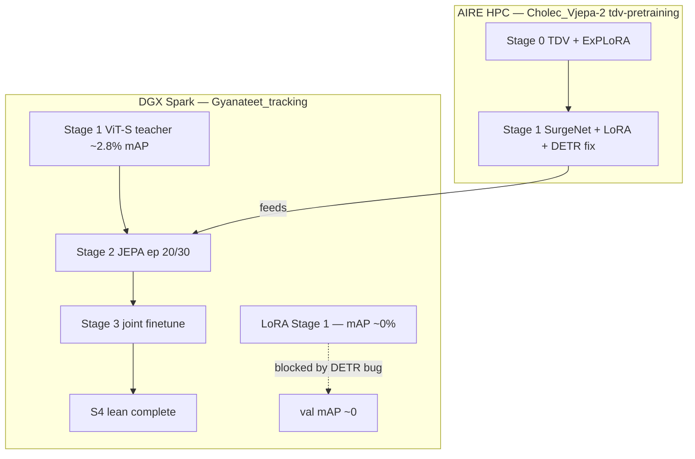

# Experiment timeline — CholecTrack20 MOT & surgical SSL

Chronological log of training runs, architecture changes, and infrastructure moves.  
Canonical project plan: [plans/gyanateet_mot_understanding.md](plans/gyanateet_mot_understanding.md).

**Benchmark context:** [CholecTrack20](https://arxiv.org/html/2312.07352) — detection SOTA ~56% AP (YOLOv7), Deformable-DETR ~38% AP; tracking SOTA generic methods **&lt;45% HOTA**; [SurgiTrack](https://arxiv.org/html/2405.20333) ~67% HOTA with strong detector + direction ReID.

---

## Pipeline evolution (high level)

| Era | Focus | Hardware | Outcome |
|-----|--------|----------|---------|
| **2026 Q1–Q2** | Four-stage GOT-JEPA baseline | DGX Spark (GB10) | S1–S3 + S4 lean trained; weak detection (~2–3% val mAP) |
| **2026-06** | Eval + smoke stratification; Stage 4 lean completion | Spark | HOTA infra wired; smoke evals often 0 preds (tracker thresholds) |
| **2026-06** | LoRA ViT-B + DN-DETR detection fix attempt | Spark | Train loss ↓, val mAP ~0% — **DETR spatial-shape bug** found |
| **2026-06** | Repo consolidation + LFS | Spark → GitHub | `Cholec_Vjepa-2` `spark-lfs-setup`: code + plans + local checkpoints |
| **2026-06** | TDV Stage 0 + DETR fixes + SurgeNet Stage 1 | Leeds AIRE (`/scratch/kcwp264`) | Branch `tdv-pretraining`; TDV resume 29k→60k |

---

## Detailed run log

### Stage 1 — Supervised scaffold (baseline teacher)

| Field | Value |
|-------|--------|
| **Config** | `configs/train_mot/dinov2/cholec20-mot-stage1-supervised.yaml` |
| **When** | May 2026 (epochs 0–99) |
| **Where** | Spark (`spark-1240`) |
| **Encoder** | Frozen DINOv2 ViT-S/14 (`dinov2_vits14`) |
| **Training** | `detector_only: true` — DETR pseudo-label teacher, not final detector |
| **Checkpoint** | `outputs/mot/cholec20-stage1-supervised/best.pth.tar` (ep 69) |
| **Metrics** | Val loss ~1.35; val mAP ~**2.8%** |
| **Notes** | Intentionally precision-leaning; low mAP expected for SSL corpus gating |

### Stage 2 — GOT-JEPA SSL

| Field | Value |
|-------|--------|
| **Config** | `configs/train_mot/dinov2/cholec80-ct20-stage2-jepa-pretrain.yaml` |
| **When** | May 2026, paused at **epoch 20/30** |
| **Where** | Spark |
| **Checkpoint** | `outputs/mot/cholec80-ct20-stage2-jepa-pretrain/latest.pth.tar` |
| **Loss** | JEPA inv ~3.82 at pause |
| **Notes** | Epochs 21–29 optional; ep 20 sufficient to start Stage 3. Teacher frozen (not EMA). SSL excludes CT20 overlap videos: `video01,06,07,12,25,30,39`. |

### Stage 3 — Joint fine-tune

| Field | Value |
|-------|--------|
| **Config** | `configs/train_mot/dinov2/cholec20-mot-stage3-joint-finetune-vits.yaml` |
| **When** | May 2026 (10 epochs) |
| **Checkpoint** | `outputs/mot/cholec20-stage3-joint-finetune-vits/best.pth.tar` (ep 3) |
| **Metrics** | Val mAP ~**2.4%** |
| **Notes** | Resume from Stage 2 `latest.pth.tar` with `--reset-optimizer` |

### Stage 4 — OccuSolver (variants)

| Variant | Config | Status | Checkpoint | Notes |
|---------|--------|--------|------------|-------|
| **Lean** | `cholec20-mot-stage4-lean.yaml` | **Complete** Jun 21 2026 | `cholec20-stage4-lean-vits/best.pth.tar` (ep 5) | CoTracker + depth **stub**; val mAP ~0.6% |
| **GOT-edit (full)** | `cholec20-mot-stage4-got-edit.yaml` | Aborted ep 0 | 4.9 GB ckpt | VGGT path; too heavy for routine use |
| **Full** | `cholec20-mot-stage4-full.yaml` | Not run | — | Reserved for geometry ablations |

### Stage 1 — LoRA + DN-DETR (detection unblock attempt)

| Field | Value |
|-------|--------|
| **Config** | `cholec20-mot-stage1-lora-detect.yaml` |
| **When** | Jun 21 2026 (~epoch 30/100 when last checked) |
| **Where** | Spark |
| **Encoder** | DINOv2 ViT-B/14 + LoRA (all blocks), DN-DETR denoising |
| **Target** | mAP@50 ≥ 0.35 |
| **Result** | Train loss 5.78 → 3.24; **val mAP ~0%** |
| **Root cause** | Deformable DETR passed spatial shape `(1, total_len)` — 2D grid destroyed. Fix on branch `tdv-pretraining`, not on Spark at time of writing. |

### Stage 0 — TDV + ExPLoRA (parallel, AIRE)

| Field | Value |
|-------|--------|
| **Config** | `configs/train_mot/dinov2/tdv-pretrain.yaml` |
| **When** | Jun 2026 |
| **Where** | AIRE — 3× L40S DDP |
| **Branch** | `tdv-pretraining` |
| **Init** | SurgeNet / endo DINOv2; motion encoder + DINO head trained to step ~29k |
| **Resume plan** | Step 29k→60k with progressive ViT unfreeze + L2-SP |
| **Purpose** | Motion-aware surgical encoder → drop into Stage 1 DETR |
| **Paper** | [TDV arXiv 2606.15956](https://arxiv.org/abs/2606.15956) |

### Stage 1 — SurgeNet + LoRA (planned / AIRE)

| Field | Value |
|-------|--------|
| **Config** | `cholec20-mot-stage1-surgenet.yaml` (HPC; may not be on all branches) |
| **Where** | AIRE |
| **Depends on** | DETR spatial-shape fix + label/val-loss fixes from HPC session |
| **Gate** | mAP@50 **0.35–0.45** before SSL corpus build |

### V-JEPA2 / SurgiTrack++ track (original `code/` pipeline)

| Phase | Script | Status |
|-------|--------|--------|
| V-JEPA2 SSL | `outputs/vjepa2-cholec-pretrain/` | Referenced from Windows/cloud; not on Spark |
| RF-DETR detection | `outputs/detection-hardened-v2/best.pt` | ~35% recall @0.5 per README |
| Re-ID | `train_reid_v2.py` | Code in repo; checkpoints TBD via LFS |

---

## Architecture & code changes over time

| Date | Change | Impact |
|------|--------|--------|
| May 2026 | Four-stage GOT-JEPA pipeline on Spark | Baseline S1–S4 lean |
| Jun 2026 | `core_app/mot/eval.py` smoke stratification + MP4 test fallback | Eval infra ready; HOTA still needs full clips + tuned tracker |
| Jun 2026 | `scripts/eval_checkpoint.py --mot-eval --stratify-smoke` | Smoke-breakdown eval |
| Jun 2026 | Stage 3 `load_checkpoint` → Stage 2 `latest.pth.tar` | Correct resume path |
| Jun 2026 | Identified deformable DETR `(1, total_len)` bug | Explains mAP≈0 on LoRA run |
| Jun 2026 | `tdv-pretraining`: per-level deformable shapes, LoRA/DN config fixes | Unblocks detection training |
| Jun 2026 | TDV `pretrain_tdv.py`, `tdv_viz.py`, resume support | AIRE Stage 0 |
| Jun 2026 | `Cholec_Vjepa-2` `spark-lfs-setup`: mirror GOT-JEPA + `dinov2/` + docs | GitHub consolidation |
| Jun 2026 | Git LFS layout for `outputs/mot/`, `weights/dinov2/` | Push blocked until LFS enabled on GitHub |

---

## Evaluation status

| Eval | Status | Notes |
|------|--------|-------|
| Val mAP (per stage) | Logged in W&B / trainer | S1 ~2.8%, S3 ~2.4%, S4 lean ~0.6% |
| Smoke HOTA/MOTA | Wired | Short clips + `min_hits=3` → often **0 predictions** |
| Full CT20 test HOTA | **Pending** | Needs tuned `birth_score` / `min_hits`, full sequences |
| Smoke-stratified breakdown | Implemented | `--stratify-smoke` on eval scripts |

---

## Hardware map

| Machine | Path | Role |
|---------|------|------|
| **DGX Spark** | `/home/aimsgroupuol/AIMSgeneral/Gyanateet_tracking` | Baseline S1–S4, LoRA debug, interactive eval |
| **Leeds AIRE** | `/scratch/kcwp264/Cholec_Vjepa-2` | TDV Stage 0, SurgeNet Stage 1, 3× L40S DDP |
| **GitHub** | [Cholec_Vjepa-2](https://github.com/Ryukijano/Cholec_Vjepa-2), [Gyanateet_tracking](https://github.com/Ryukijano/Gyanateet_tracking) | Code + docs; checkpoints via LFS when enabled |

---

## Current recommended path (Jun 2026)

1. Merge `tdv-pretraining` **DETR fix** into Spark `Gyanateet_tracking`.
2. Retrain Stage 1 on AIRE (SurgeNet or TDV encoder); **gate on mAP@50 ≥ 0.35**.
3. `build_ssl_corpus.py` → Stage 2 JEPA → Stage 3 joint → optional Stage 4 lean re-run.
4. Full HOTA on CT20 test with smoke stratification.
5. Enable Git LFS or HF Hub for checkpoint distribution.

---

*Last updated: 2026-06-25. Update this file when a run completes or a blocker is resolved.*
