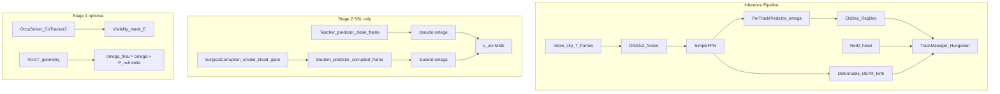
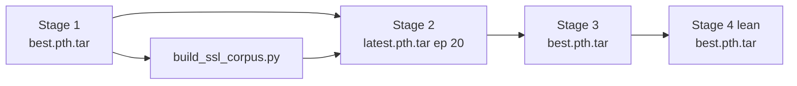

# Gyanateet_tracking — What We Are Doing Here

> **Canonical plan** for the GOT-JEPA surgical MOT pipeline in this repo.  
> Last updated: June 2026 (DGX Spark training complete through Stage 4 lean).

## The Problem

**Goal:** Track multiple surgical tools (grasper, hook, scissors, etc.) with persistent IDs in laparoscopic cholecystectomy video, even under visual degradation.

**Benchmark:** [CholecTrack20](https://arxiv.org/html/2312.07352) (CVPR 2025) — 20 full-length videos, 65K tool instances, annotated at 1 fps. It defines three tracking perspectives (visibility, intracorporeal, intraoperative) and labels per-frame visual challenges (smoke, bleeding, occlusion). Current SOTA methods score **below ~45% HOTA** — far from clinical readiness.

**Baseline to beat:** [SurgiTrack](https://arxiv.org/html/2405.20333) — YOLOv7 detection + motion-direction ReID + bipartite graph matching. Strong on CT20 but lacks JEPA-style occlusion invariance.

---

## Our Approach (Not Generic GOT-JEPA)

This repo is a **surgical specialization** of [GOT-JEPA](https://arxiv.org/abs/2602.14771) (TCSVT 2026). The paper tracks **one object** via per-track filter weights `ω`. We extend it to **multi-tool MOT**:

| Component | Role |
|-----------|------|
| Frozen **DINOv2 ViT-S/14** | Spatial encoder (384-dim tokens @ 392px) |
| **SimpleFPN neck** | Multi-scale features P3/P4/P5 |
| **Deformable DETR** | Birth-only detection (7 tool classes, 16 queries) |
| **PerTrackModelPredictor** | Hypernetwork producing filter `ω_k` per active track |
| **ClsDec / RegDec** | Decode `ω` → score map + box regression |
| **ReID head** | 256-dim embeddings for re-identification after occlusion |
| **TrackManager** | Hungarian association + birth/death/re-entry |
| **GOTJEPAWrapper** (Stage 2) | Teacher/student on `ω` under surgical corruptions |
| **OccuSolver** (Stage 4) | CoTracker3 visibility + learned visibility heads |
| **VGGT geometry** (Stage 4 full) | Null-space perturbation of `ω` (GOT-Edit) |

Entry point: [`core_app/mot/main.py`](../../core_app/mot/main.py) → [`MOTTrainer`](../../core_app/mot/trainer.py) dispatches by `meta.stage`.



---

## Four-Stage Training Pipeline

Each stage consumes the previous checkpoint. Stage is set in YAML under `meta.stage`.  
**Detailed guide:** [TRAINING_STAGES.md](../TRAINING_STAGES.md)

### Stage 1 — Supervised Scaffold (`stage1_supervised`)
- **Config:** [`configs/train_mot/dinov2/cholec20-mot-stage1-supervised.yaml`](../../configs/train_mot/dinov2/cholec20-mot-stage1-supervised.yaml)
- **Data:** CholecTrack20 train split (`cholec_dataset` or `data/cholectrack20`)
- **Trains:** Deformable DETR only (`detector_only: true`) — precision-leaning pseudo-label teacher
- **Output:** `outputs/mot/cholec20-stage1-supervised/best.pth.tar` (ep 69, val mAP ~2.8%)

### Stage 2 — GOT-JEPA SSL (`stage2_jepa`)
- **Config:** [`configs/train_mot/dinov2/cholec80-ct20-stage2-jepa-pretrain.yaml`](../../configs/train_mot/dinov2/cholec80-ct20-stage2-jepa-pretrain.yaml)
- **Prerequisite:** Stage 1 + SSL corpus from [`scripts/got_jepa/build_ssl_corpus.py`](../../scripts/got_jepa/build_ssl_corpus.py)
- **Trains:** Student predictor + ProjNet + Expander; **frozen** teacher predictor (not EMA)
- **Output:** `outputs/mot/cholec80-ct20-stage2-jepa-pretrain/latest.pth.tar` (ep 20/30 — sufficient for Stage 3)

### Stage 3 — Joint Fine-Tune (`stage3_joint`)
- **Config:** [`configs/train_mot/dinov2/cholec20-mot-stage3-joint-finetune-vits.yaml`](../../configs/train_mot/dinov2/cholec20-mot-stage3-joint-finetune-vits.yaml)
- **Launch:** `--resume outputs/mot/cholec80-ct20-stage2-jepa-pretrain/latest.pth.tar --start-epoch 0 --reset-optimizer`
- **Output:** `outputs/mot/cholec20-stage3-joint-finetune-vits/best.pth.tar` (ep 3, val mAP ~2.4%)

### Stage 4 — Full Stack (optional)
| Variant | Config | Status (Jun 2026) |
|---------|--------|-------------------|
| **Lean (GB10)** | `cholec20-mot-stage4-lean.yaml` | **Complete** — `best.pth.tar` ep 5, `depth_stub: true` |
| Full | `cholec20-mot-stage4-full.yaml` | Not run |
| GOT-Edit | `cholec20-mot-stage4-got-edit.yaml` | Aborted ep 0 (4.9 GB ckpt — not in repo) |

**Active experiment:** `cholec20-mot-stage1-lora-detect.yaml` — LoRA ViT-B/14 + DN-DETR to fix weak detection.

---

## Checkpoint Chain



Checkpoints are under `outputs/mot/` in this repo (Git LFS — see [ENABLE_GIT_LFS.md](../ENABLE_GIT_LFS.md)).  
DINOv2 ImageNet weights: `weights/dinov2/`.

---

## How to Run (DGX Spark / GB10)

```bash
cd /path/to/Cholec_Vjepa-2
conda activate surgi_track
export PYTHONPATH="${PWD}:${PYTHONPATH}"
export XFORMERS_DISABLED=1   # required for DINOv2 on GB10
bash scripts/setup_spark.sh  # symlinks cholec_dataset → CT20
```

```bash
python -m core_app.mot.main \
  --fname configs/train_mot/dinov2/cholec20-mot-stage4-lean.yaml \
  --devices cuda:0
```

**Trusted scripts:** `scripts/got_jepa/train_stage1_gb10_1gpu.sh`, `scripts/got_jepa/train_stage1_ddp_3gpu.sh`  
**Eval:** `scripts/got_jepa/eval_checkpoint.py --mot-eval --stratify-smoke`, `scripts/got_jepa/eval_mot_hota.py`  
**Tests:** `pytest tests/test_mot_smoke.py`

---

## Research Landscape

| Method | Fit |
|--------|-----|
| **GOT-JEPA** | Core lineage — predicts tracking model `ω`, OccuSolver for occlusion |
| **CholecTrack20** | Primary benchmark with smoke/bleeding/occlusion labels |
| **SurgiTrack** | Baseline competitor (~62.8% HOTA on CT20 in their report) |
| **VLA-JEPA** | Wrong output space (actions, not boxes) — complementary only |
| **Pixel desmoking** | Does not improve tracking; our path is invariant `ω` + visibility |

---

## Current Status and Next Steps (Jun 2026)

| Stage | Status |
|-------|--------|
| 1 | Complete — pseudo-label teacher |
| 2 | Paused ep 20/30 — sufficient for S3 |
| 3 | Complete |
| 4 lean | Complete |
| LoRA detect | In progress — target stronger mAP |

**Blockers (priority):**
1. No full HOTA/MOTA eval yet (smoke clips + strict tracker thresholds → 0 preds)
2. Weak detection (~2–3% val mAP vs CT20 baselines ~38–56% AP)
3. Stage 4 `depth_stub: true`; Stage 2 only 20/30 epochs

**Recommended next:**
1. Full HOTA eval Stage 3 vs Stage 4 with tuned `birth_score` / `min_hits`
2. Finish or iterate LoRA Stage 1 detection experiment
3. Enable Git LFS and push checkpoints (`bash scripts/upload_checkpoints_lfs.sh`)
4. Leeds Aire for HP sweeps after baseline eval

---

## Key Code Map

| File | Purpose |
|------|---------|
| `core_app/mot/main.py` | CLI entry, dataloaders, DDP |
| `core_app/mot/trainer.py` | Stage dispatch, optimizer, checkpoints |
| `core_app/mot/system.py` | `SurgicalMOTSystem` assembly |
| `core_app/mot/jepa.py` | GOT-JEPA teacher/student |
| `core_app/mot/augment.py` | Surgical corruptions |
| `core_app/mot/occusolver.py` | CoTracker + visibility |
| `core_app/mot/eval.py` | HOTA/MOTA + smoke stratification |
| `core_app/data/splits.py` | Leak-free CT20/Cholec80 splits |

---

## Dual pipeline in this repo

| Track | Path | Plan |
|-------|------|------|
| **GOT-JEPA MOT** | `core_app/`, `configs/train_mot/` | This document |
| **V-JEPA2 SurgiTrack++** | `code/`, `docs/ARCHITECTURE.md` | RF-DETR + V-JEPA2 Re-ID + SurgicalTrackerV2 |

---

## Bottom Line

**We are building a surgical multi-tool tracker that learns object permanence** — tools keep their identity through smoke, blood, glare, and partial occlusion — by adapting GOT-JEPA's model-predictive SSL to laparoscopy, with DETR detection and ReID association on CholecTrack20.
